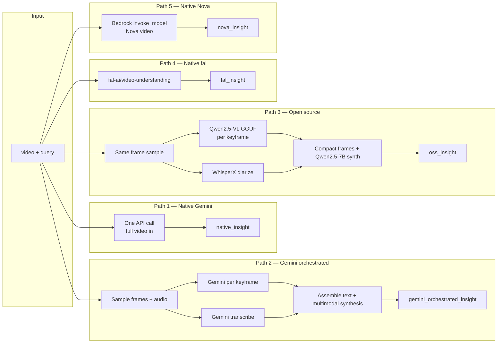
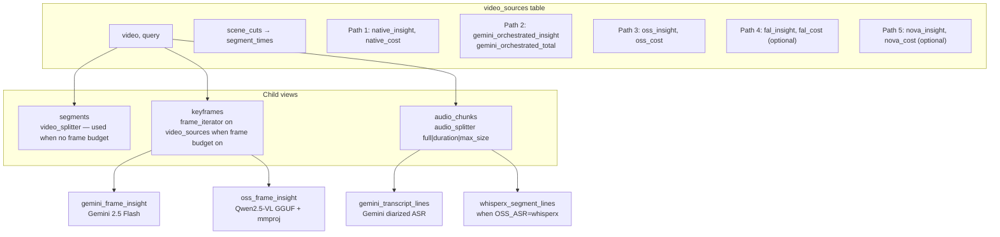
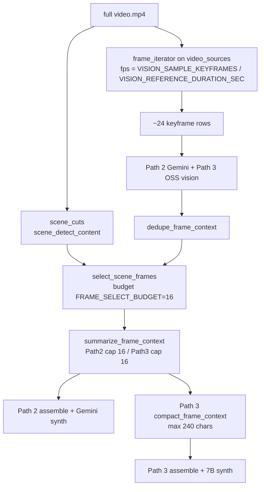
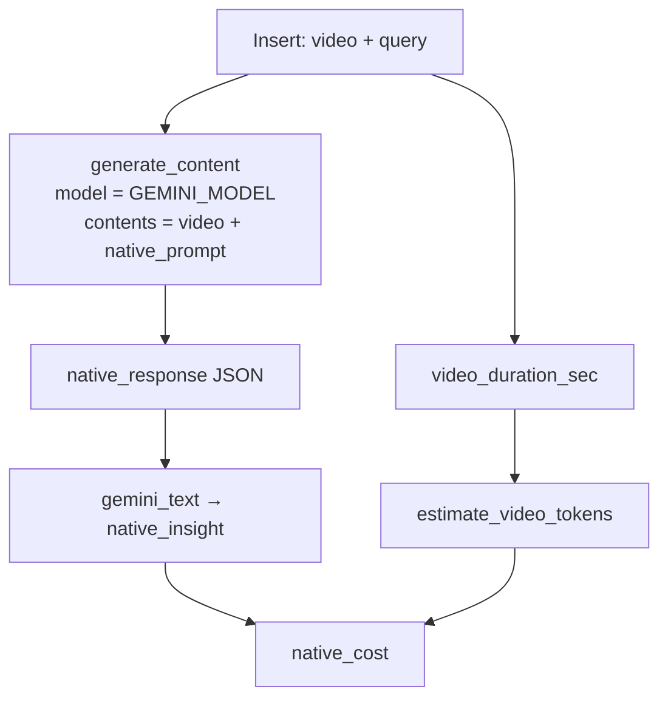
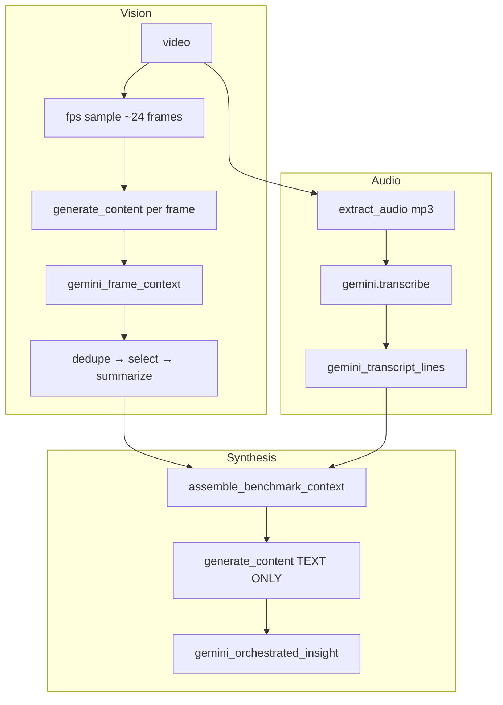
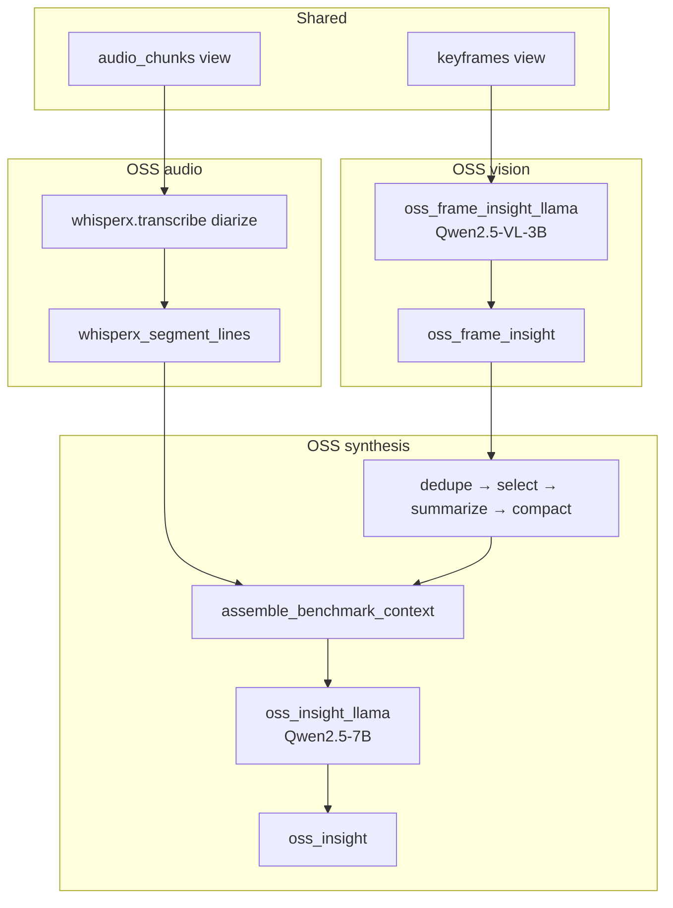
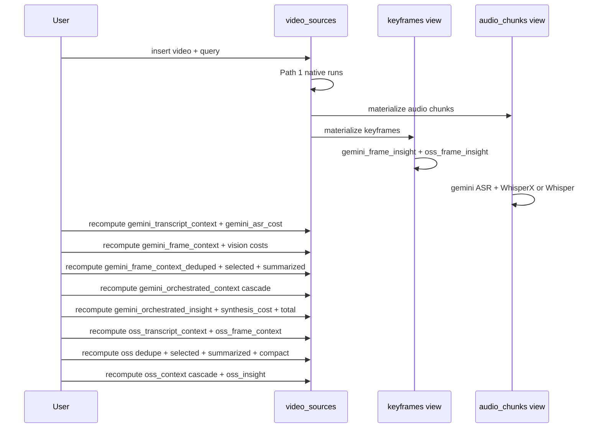

# Video Benchmark Workflow

Five paths answer the **same question** about the **same video**, using different strategies. All paths live in the Pixeltable **0.7.8** catalog `video_benchmarking/`, declared as path-gated `TableModel` classes and applied with `TableModel.update_all()`. Paths 4–5 soft-skip without credentials. Use **`--reset`** when changing paths or after a schema change.

**Default model:** `gemini-2.5-flash` (Path 1 and Path 2). Override with `GEMINI_MODEL`. Path 5 defaults to **Nova Pro** (`amazon.nova-pro-v1:0`). Path 4 (**fal**) auto-trims input to **120s** (API max ~122s) and bills ~$0.01 per 5s of that capped clip — often costlier than Gemini native on long samples.

**Default frame pipeline:** `SCENE_AWARE_FRAMES=1` → sample **24** frames evenly (`num_frames`) → keep **16** near scene cuts (spread across the full timeline) → Path 2 synthesizes with up to **16** captions + up to **8** keyframe images; Path 3 compact-caps to **16** × 240 chars. Path 3 ASR defaults to **WhisperX** (falls back to Whisper without `HF_TOKEN`); synthesis defaults to **Qwen2.5-7B**.

**Reference export (showcase):** [`results/golden/`](../results/golden/) (`fair_v1_nova_pro`). Historical lab timestamps live under `results/` locally (gitignored) — see [LAB_RESULTS.md](LAB_RESULTS.md).

**CLI paths:** `run-benchmark --paths 1,2` (default) · `--paths 3` · `--paths 1,2,3` · optional `4`/`5` when fal/Nova enabled.
---

## 1. Big picture — five paths side by side



| | Path 1 Native Gemini | Path 2 Gemini orchestrated | Path 3 Open source | Path 4 Native fal | Path 5 Native Nova |
|---|---|---|---|---|---|
| **What goes in** | Whole `.mp4` + question | Sparse keyframe images + audio transcripts | Same frame sample as Path 2 | Public `video_url` + prompt (**≤120s**) | Video bytes/S3 + prompt |
| **Vision** | Inside Gemini (opaque) | `generate_content` per sampled frame | `oss_frame_insight_llama` (Qwen2.5-VL + mmproj) | fal video-understanding | Nova Pro (default) 1 FPS sampling |
| **Audio** | Inside Gemini (opaque) | `gemini.transcribe` (default: **full file**) | WhisperX diarize (or Whisper / Gemini ASR) | Inside fal | Inside Nova |
| **Final step** | (same call) | Multimodal `generate_content` (text + ≤8 images) | `oss_insight_llama` (Qwen2.5-7B GGUF) | (same call) | (same call) |
| **Output column** | `native_insight` | `gemini_orchestrated_insight` | `oss_insight` | `fal_insight` | `nova_insight` |
| **Cost column** | `native_cost` | `gemini_orchestrated_total` | `oss_cost` (= $0) | `fal_cost` ($0.01/5s) | `nova_cost` |

---

## 2. Pixeltable catalog — tables and views



With default frame budget, **keyframes attach to `video_sources`**, not `segments`. The `segments` view is created only when there is no frame budget (all-I-frames / `video_splitter` mode).

**Query with `pxt`:**

```bash
pxt ls video_benchmarking
pxt rows video_benchmarking/video_sources -n 1 --cols native_insight,gemini_orchestrated_insight,oss_insight
pxt rows video_benchmarking/keyframes -n 5 --cols global_position_ms,gemini_frame_insight,oss_frame_insight
```

---

## 2.5 Video / frame pipeline for Paths 2 & 3



| Mode | When | Behavior |
|------|------|----------|
| **Scene-aware (default)** | `SCENE_AWARE_FRAMES=1` | Sample `VISION_SAMPLE_KEYFRAMES` (24) on full video; select `FRAME_SELECT_BUDGET` (16) near scene cuts |
| **Uniform fps** | `SCENE_AWARE_FRAMES=0` and `MAX_VISION_KEYFRAMES>0` | Sample ~12 frames on full video |
| **All I-frames per scene** | `SCENE_AWARE_FRAMES=0` and `MAX_VISION_KEYFRAMES=0` | `segments` → `frame_iterator(keyframes_only=True)` |

**Shared frame prep order (Path 2 and Path 3):** `dedupe → select_scene_frames → summarize` → Path 3 only: `compact`.

| Column | Path | Role |
|--------|------|------|
| `gemini_frame_context` / `oss_frame_context` | 2 / 3 | Full vision rollup lists |
| `*_frame_context_deduped` | 2 / 3 | Near-duplicate captions removed |
| `*_frame_context_selected` | 2 / 3 | Scene-aware keep (when enabled) |
| `*_frame_context_summarized` | 2 / 3 | Cap to Path 2 `FRAME_CONTEXT_MAX_ENTRIES` (16) or Path 3 `OSS_FRAME_CONTEXT_MAX_ENTRIES` (16) |
| `oss_frame_context_compact` | 3 | Short captions for 7B context window |
| `whisperx_diarized` / `whisperx_segment_lines` | 3 | When `OSS_ASR=whisperx` |
| `whisper_segment_lines` | 3 | When `OSS_ASR=whisper` |
| `gemini_transcript_lines` | 2 (+ 3 if `OSS_ASR=gemini`) | Diarized Gemini ASR |

**Audio split mode** (`AUDIO_SPLIT_MODE`, default `full`): one transcribe call on the full MP3 by default.

**ASR gating:** Path 2 always runs Gemini ASR. Path 3 adds only Whisper **or** WhisperX columns (not both). When `OSS_ASR=gemini`, Path 3 reuses Gemini transcript lines.

---

## 2.6 Scene-aware frame selection

`select_scene_frames` prefers frames near `scene_cuts` start times (up to half the budget), then fills remaining slots with timeline-spread samples. Both paths use the same selected set before their respective summarize caps.

---

## 3. Path 1 — Native video (one hop)

Gemini sees the **entire video file** and hears audio internally. No splitting.



---

## 4. Path 2 — Gemini orchestrated



### API call counts (Path 2, default config)

On a **~255s** Pursuit clip (`AUDIO_SPLIT_MODE=full`, `SCENE_AWARE_FRAMES=1`, `VISION_SAMPLE_KEYFRAMES=24`, `GEMINI_VISION_MODE=per_frame`):

| Step | Gemini API calls |
|------|------------------|
| Vision (`generate_content` per keyframe) | **~24** |
| ASR (`gemini.transcribe`) | **1** |
| Synthesis (`generate_content` text-only) | **1** |
| **Path 2 total** | **~26** |
| Path 1 native (comparison) | **+1** full-video call |

`summary.json` reports `keyframe_count` = vision API frames (~24) and `gemini_synthesis_frame_count` = frames in synthesis context after select/cap (~16). Vision track cost sums **all API frames**; synthesis uses the capped list.

With `GEMINI_VISION_MODE=batched`, vision becomes **⌈N / batch_size⌉** multi-image calls; per-keyframe Gemini columns are omitted and export reads parent `gemini_frame_context`.

---

## 5. Path 3 — Open source



| Step | API | Notes |
|------|-----|-------|
| Per-keyframe vision | `oss_frame_insight_llama` | Qwen2.5-VL-3B + mmproj |
| Audio | WhisperX (default) | Requires `pip install -e ".[whisperx]"` + `HF_TOKEN` |
| Frame prep | dedupe → select → summarize → **compact** | Cap **16** frames × **240** chars |
| Synthesis | `oss_insight_llama` | Qwen2.5-7B, `n_ctx=8192`, `OSS_SYNTH_MAX_TOKENS=2048` |

---

## 6. Catalog persistence — why `--reset` matters

Each `run-benchmark` without `--reset` inserts a new `video_sources` row and more child rows. Reporting uses the **latest** parent row for insights/costs, but `keyframes.csv` exports the **entire** keyframes view.

**For reproducible paper numbers, always use `--reset`:**

```bash
run-benchmark --video assets/pursuit-of-happiness.mp4 --reset --export results/
```

---

## 7. Insert lifecycle — recompute after insert



---

## 8. Cost comparison

| Metric | Approx (Pursuit ~255s, default) |
|--------|----------------------------------|
| `native_cost` | ~$0.114 |
| `gemini_orchestrated_total` | ~$0.037 |
| `gemini_vision_track_cost` | ~$0.017 (~24 API frames) |
| `gemini_asr_cost` | ~$0.012 |
| `gemini_synthesis_cost` | ~$0.008 (~16 context frames) |
| `oss_cost` | $0.00 |

**Heuristic disclaimer:** Cost columns use token heuristics in `udfs.py` (258 tokens/image + frame-prompt overhead, 263 tokens/sec video + native-prompt overhead, 32 tokens/sec audio). When Gemini returns `usageMetadata`, `resolved_gemini_cost` prefers **actual** prompt/candidate counts (`candidatesTokenCount` only — not `totalTokenCount`).

---

## 9. Video-MME evaluation (dev slice)

Cost-bounded phase-2 eval on [`lmms-lab/Video-MME`](https://huggingface.co/datasets/lmms-lab/Video-MME):

- Stratified **30 questions** (short / medium / long)
- **Paths 1, 2, 3, 5** (Gemini native + orchestrated, local OSS, Nova); **fal skipped** (120s cap)
- Path 3 reuses **shared Gemini ASR** + local VLM keyframe captions + 7B MCQ synth (API $0)
- Catalog dir `videomme/` (separate from Pursuit `video_benchmarking/`)
- Path 2/3: frames (+ OSS captions) once per video; MCQ synthesis per question
- Metrics: exact-match letter (A–D), `cost_per_correct`, `ingest_failed` for empty native/Nova
- CLI: `--paths 1,2,3,5`, `--skip-oss`, `--skip-nova`

```bash
pip install -e ".[videomme]"
NOVA_MODEL_ID=amazon.nova-lite-v1:0 ./scripts/run_videomme_dev.sh
# Env: VIDEOME_DEV_N=30 VIDEOME_DEV_SEED=42 VIDEOME_PATHS=1,2,3,5
```

Artifacts: `results/videomme-dev/<timestamp>/` (`summary.json`, `predictions.jsonl`, `REPORT.md`).

---

## 10. File map

| File | Role |
|------|------|
| [`src/video_benchmark/cli.py`](../src/video_benchmark/cli.py) | CLI: `run-benchmark` |
| [`src/video_benchmark/config.py`](../src/video_benchmark/config.py) | Env → `BenchmarkConfig` |
| [`src/video_benchmark/schema.py`](../src/video_benchmark/schema.py) | Pursuit `TableModel` classes + `update_all` |
| [`src/video_benchmark/pipeline.py`](../src/video_benchmark/pipeline.py) | Bind catalog tables after schema apply |
| [`src/video_benchmark/videomme/`](../src/video_benchmark/videomme/) | Video-MME dev slice (sample, Path 1–2, export) |
| [`src/video_benchmark/runner.py`](../src/video_benchmark/runner.py) | Insert + recompute order |
| [`src/video_benchmark/oss_providers.py`](../src/video_benchmark/oss_providers.py) | Path 3 vision + synthesis UDFs |
| [`src/video_benchmark/udfs.py`](../src/video_benchmark/udfs.py) | Prompts, costing, frame prep |
| [`src/video_benchmark/queries.py`](../src/video_benchmark/queries.py) | `@pxt.query` rollups |
| [`src/video_benchmark/reporting.py`](../src/video_benchmark/reporting.py) | Three-way comparison + export |
| [`src/video_benchmark/scoring.py`](../src/video_benchmark/scoring.py) | Native-parity heuristics |

---

## 11. Run it

```bash
pip install -e ".[dev,whisperx]"
cp .env.example .env   # set GOOGLE_API_KEY and HF_TOKEN

run-benchmark --paths 1,2 --video assets/pursuit-of-happiness.mp4 --reset --export results/

# Lab only (not part of the showcase story):
# ./scripts/run_tune_ab.sh
```

**Full env reference** (defaults aligned with `config.py`; README lists only the intentional knobs):

```bash
# --- Showcase knobs ---
VISION_SAMPLE_KEYFRAMES=24
FRAME_SELECT_BUDGET=16
FRAME_CONTEXT_MAX_ENTRIES=16
GEMINI_SYNTH_MAX_IMAGES=8
GEMINI_MODEL=gemini-2.5-flash
BENCHMARK_PATHS=1,2

# --- Pipeline ---
AUDIO_SPLIT_MODE=full
SCENE_AWARE_FRAMES=1
MAX_VISION_KEYFRAMES=12
VISION_REFERENCE_DURATION_SEC=260.0
GEMINI_VISION_MODE=per_frame
SCENE_DETECT_THRESHOLD=20.0
MIN_SEGMENT_DURATION=1.0
SEGMENT_FALLBACK_WINDOW_SEC=10.0

# --- Path 3 OSS ---
OSS_ASR=whisperx
WHISPERX_MODEL=small.en
WHISPERX_MIN_SPEAKERS=2
HF_TOKEN=
OSS_BACKEND=llama_cpp
OSS_VISION_REPO_ID=unsloth/Qwen2.5-VL-3B-Instruct-GGUF
OSS_VISION_REPO_FILENAME=Qwen2.5-VL-3B-Instruct-Q4_K_M.gguf
OSS_VISION_MMPROJ_REPO_FILENAME=mmproj-F16.gguf
OSS_SYNTH_REPO_ID=Qwen/Qwen2.5-7B-Instruct-GGUF
OSS_SYNTH_REPO_FILENAME=qwen2.5-7b-instruct-q3_k_m.gguf
OSS_SYNTH_MAX_TOKENS=2048
OSS_FRAME_CONTEXT_MAX_ENTRIES=16
OSS_FRAME_INSIGHT_MAX_CHARS=240

# --- Optional natives (not hero paths) ---
# ENABLE_FAL=1  FAL_KEY=...
# ENABLE_NOVA=1  AWS_*/Bedrock...

# Lab tagging only:
# BENCHMARK_TUNE_TAG=baseline
```

Recipes: [`examples/orchestrated.env`](../examples/orchestrated.env), [`examples/oss.env`](../examples/oss.env).
