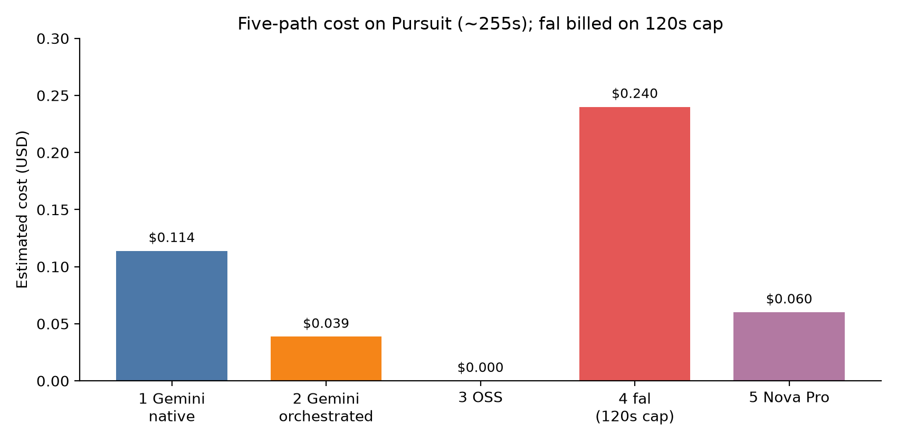
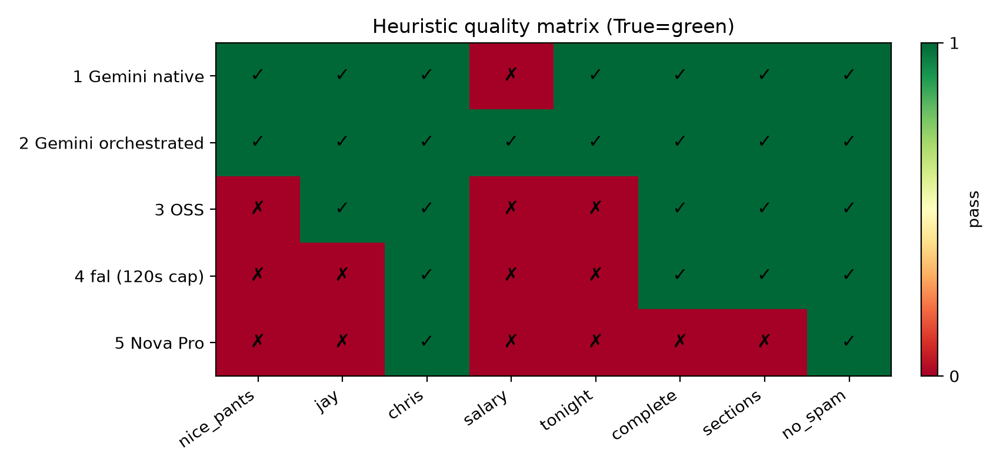
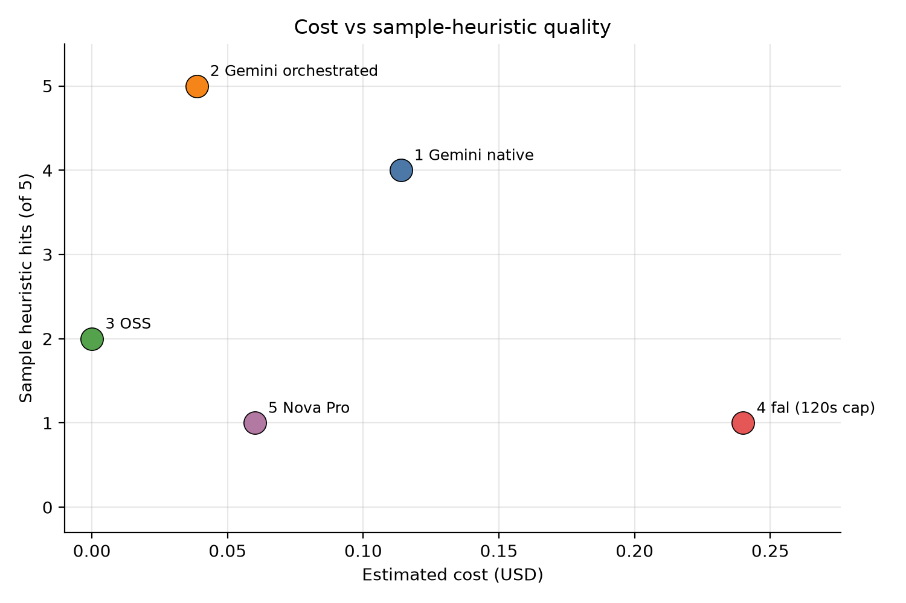
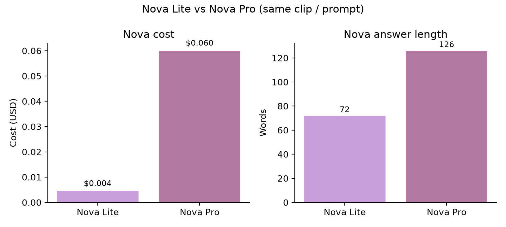

# Abstract

Native multimodal models (NMMs) process full video end-to-end, while modular pipelines sample keyframes, transcribe audio, and synthesize answers. We ask which architecture wins on **cost and narrative quality** for a fixed long-form clip when prompts and evaluation are held fair. We implement five paths in a declarative [Pixeltable](https://pixeltable.com) catalog [@pixeltable]: (1) native Gemini 2.5 Flash on the full video; (2) Gemini keyframe orchestration with multimodal synthesis; (3) open-source Qwen2.5-VL + WhisperX + Qwen2.5-7B; (4) fal-ai/video-understanding (120s API cap); and (5) Amazon Nova Pro on Bedrock. On a ~255s *Pursuit of Happyness* interview clip (`fair_v1_nova_pro`, committed as `results/golden/`), Path 2 costs **$0.039** versus Path 1 **$0.114** (~66% cheaper) and uniquely passes all five sample heuristics plus general completeness checks. Path 3 is free of API cost but misses punchline and salary details. fal is most expensive (**$0.24**) and incomplete under the duration cap. Nova Pro (**$0.060**) improves on Lite but remains terse and partially incorrect. We conclude that, on this narrative Q&A task, **same-model orchestration dominates native Gemini on cost–quality**, while third-party natives are not automatically competitive once duration limits and pricing are accounted for.

# 1 Introduction

Industry discourse increasingly favors **early-fusion NMMs** that ingest video tokens jointly with text [@apple2025scaling; @native2026roadmap]. Production systems, however, still rely on **late-fusion orchestration**: sparse frames, ASR, and a synthesis LLM—patterns studied under query-aware keyframe selection [@qca2026; @aks2025; @toolmerge2026]. The open question is not whether natives can reason about video, but whether they are the right default when **token cost, API duration caps, and answer completeness** matter.

A second practical issue is **comparability**. Vendor demos often mix model families, prompt engineering, and cherry-picked clips. We hold the video, query, and (for Paths 1–2) Gemini model fixed, then vary only architecture or provider. Optional natives (fal, Nova) share the same `native_prompt` so differences reflect API behavior and pricing, not prompt drift.

This paper contributes:

1. A **reproducible five-path Pixeltable pipeline** with computed columns, soft-fail optional natives, and machine-readable exports (`summary.json`, `insights.json`, `TUNE_COMPARISON.md`).
2. A **fairness methodology**: duration-agnostic `num_frames` sampling, timeline-spread scene slots, identical `native_prompt` across native APIs, sample-only vs general heuristic scoring, and removal of sample-specific prompt keywords that previously inflated Path 3.
3. A **cross-provider native comparison** (Gemini / fal / Nova) under one analysis query.
4. Empirical **cost–quality findings** on a fixed ~255s narrative clip, including a Nova Lite vs Pro ablation.

# 2 Related Work

**Early vs late fusion.** Scaling studies argue that native multimodal training improves joint audiovisual reasoning relative to caption-then-LLM stacks [@apple2025scaling; @native2026roadmap]. Classic late fusion fails when captions omit the detail needed downstream. Our Path 1 instantiates early fusion via Gemini video `generate_content`. Path 3 is modular late fusion, but with a **vision LLM on keyframes** rather than generic captions—closing part of the historical gap while remaining token-sparse.

**Token-efficient keyframes.** QCA, AKS, and ToolMerge reduce long-video cost by selecting informative frames [@qca2026; @aks2025; @toolmerge2026]. Path 2 follows that spirit: sample evenly, keep frames near scene cuts spread across the timeline, then synthesize with capped multimodal context. We do not claim a new selection algorithm; we measure whether a simple AKS/QCA-style budget already beats full-video native cost on narrative Q&A.

**Temporal continuity.** VideoOdyssey argues discrete frames can break long causal chains [@videoodyssey2026]. We treat fps/scene sampling as a practical compromise and leave dense native encoding to Paths 1/4/5. The Pursuit clip’s late salary beat is a stress test for whether sparse selection preserves end-of-timeline content.

**Evaluation.** Video-MME provides large-scale MCQ evaluation for video MLMs [@fu2025videomme]. This paper’s primary study is qualitative/cost on one clip (phase 1). **Phase 2 (dev):** a stratified 30-question Video-MME slice is implemented in-repo (`run-videomme-dev`): Gemini Paths 1–2 reach ~80% / ~67–70% exact-match with Path 2 ~12× cheaper per correct after fixing cross-video ASR bleed; Path 3 OSS (shared Gemini ASR + local VLM/7B) trails; Nova Lite often fails Bedrock video-byte limits without S3. Full 900V/2700Q remains future work.

# 3 System

All paths share one catalog (`video_benchmarking/`), one video row, and one query string, declared as Pixeltable **0.7.8 `TableModel`** classes and applied with `update_all()`. Child views materialize keyframes and audio chunks; parent computed columns assemble path outputs and costs [@pixeltable]. The design goal is **declarative reproducibility**: inserting a video triggers the same computed graph that produced the paper exports, rather than a one-off notebook script. This repository is a CLI batch benchmark, not a FastAPI / `pxt service` app.

## 3.1 Catalog layout

`video_sources` holds the media file and query. Scene detection yields segment boundaries. When a frame budget is enabled, a `keyframes` view samples frames from the parent video; an `audio_chunks` view splits audio (default: one full-file chunk for Gemini ASR). Path 2 and Path 3 attach per-frame vision columns on `keyframes`, then roll up into parent synthesis columns. Paths 1, 4, and 5 are parent-only native calls. Optional fal/Nova wrappers soft-fail so missing credentials do not block Gemini or OSS paths.

## 3.2 Five paths

| Path | Mechanism | Primary models | Cost column |
|------|-----------|----------------|-------------|
| 1 Native Gemini | Full `.mp4` → one `generate_content` | `gemini-2.5-flash` [@gemini25flash] | `native_cost` |
| 2 Gemini orchestrated | 24 sampled frames → 16 scene-selected → Gemini vision + `gemini.transcribe` → multimodal synth (<=8 images) | same Gemini | `gemini_orchestrated_total` |
| 3 OSS | Same frames → Qwen2.5-VL captions + WhisperX → Qwen2.5-7B synth | local GGUF [@qwen25vl; @whisperx] | `oss_cost` (= $0) |
| 4 Native fal | Public URL → `fal-ai/video-understanding` (input trimmed to **120s**) | fal API [@falvideounderstanding] | `fal_cost` |
| 5 Native Nova | Full video → Bedrock `converse` | `amazon.nova-pro-v1:0` [@novabedrock] | `nova_cost` |

Paths 1 and 2 use the **same Gemini model**, so differences isolate architecture. Paths 4–5 reuse Path 1's `native_prompt`. Path 2's orchestrated total decomposes into vision-track, ASR, and synthesis sub-costs in `summary.json` (headline: ~$0.017 / $0.013 / $0.008).

# 4 Fairness Methodology

Without fairness controls, modular paths can look artificially strong (sample-specific prompt keywords) or artificially weak (frames clustered at the start of the clip). We treat fairness as a first-class experimental variable.

**Shared native prompt.** All native APIs receive `Analyze this video and answer the following question thoroughly` plus the user query—no provider-specific coaching and no Pursuit spoilers.

**De-cheated modular prompts.** Frame and synthesis prompts ask for visible people, setting, expressions, and interview-like structure **without** Pursuit-specific keywords (e.g., “nice pants,” salary beats) that previously biased Path 3 toward the scoring rubric. After de-cheating, Path 3 must recover those beats from pixels and ASR alone.

**Duration-agnostic sampling.** With `SCENE_AWARE_FRAMES=1`, the pipeline samples a fixed `VISION_SAMPLE_KEYFRAMES` (default 24) via `num_frames`, then keeps `FRAME_SELECT_BUDGET` (default 16) near scene cuts **spread across the full timeline**, avoiding early-clip bias that would starve late dialogue (salary / “tonight”).

**Identical query.** Headline query: *Summarize the main activities, speakers, and visual events in this video.*

**Scoring.** Sample-only heuristics (`nice_pants`, `jay`, `chris`, `salary`, `tonight`) are Pursuit-tuned narrative checks. General metrics (`complete`, `truncated`, `sections`, `no_spam`) apply across paths. The salary scorer accepts unpaid/no-salary phrasing rather than a brittle substring that previously under-counted correct answers.

# 5 Experimental Setup

**Clip.** `assets/pursuit-of-happiness.mp4`, duration **254.96s** (Chris Gardner interview scene). The clip is dialogue-heavy with a late unpaid-internship reveal—useful for testing whether sparse sampling preserves end-of-timeline content.

**Headline run.** Tag `fair_v1_nova_pro`, committed export `results/golden/` (lab provenance `results/20260710T040910Z`). Config highlights: Gemini `gemini-2.5-flash`; scene-aware 24→16 frames; Path 2 synth at most 8 images; Path 3 WhisperX + Qwen2.5-VL-3B + Qwen2.5-7B; fal enabled; Nova `amazon.nova-pro-v1:0`.

**Ablation run.** Tag `fair_v1_fal_nova`, export `results/20260710T025835Z` — same setup with **Nova Lite** for Lite vs Pro comparison. Earlier three-path fair run `results/20260709T044103Z` and cleanup run `results/20260709T025231Z` (`canonical`, Path 2 ~$0.037 vs native ~$0.115) corroborate the Gemini cost gap before fal/Nova were added.

**Cost accounting.** Gemini costs prefer `usage_metadata` when present, else published Flash rates. fal is billed as **$0.01 per 5s** on the **120s** capped input ($0.24). Nova uses Bedrock token rates for the configured model. OSS API cost is $0 (local GPU/CPU time and energy are not monetized in this paper).

# 6 Results

## 6.1 Cost

{ width=90% }

| Path | Cost (USD) | Words |
|------|------------|------:|
| 1 Gemini native | 0.114 | 451 |
| 2 Gemini orchestrated | **0.039** | 1021 |
| 3 OSS | 0.000 | 375 |
| 4 fal (120s cap) | 0.240 | 324 |
| 5 Nova Pro | 0.060 | 126 |

Path 2 is ~**66% cheaper** than Path 1 ($0.075 absolute delta), consistent with the earlier canonical three-path export (~67% savings). fal is ~**2.1×** Path 1 despite seeing only the first ~120s of a 255s clip. Nova Pro sits between orchestrated Gemini and native Gemini on dollars, but not on quality (below). Path 2's length (1021 words) reflects timestamped visual sections rather than padding alone.

## 6.2 Heuristic quality

{ width=90% }

| Path | nice_pants | jay | chris | salary | tonight | complete | sections | no_spam |
|------|:----------:|:---:|:-----:|:------:|:-------:|:--------:|:--------:|:-------:|
| 1 native | Y | Y | Y | N | Y | Y | Y | Y |
| 2 gemini | Y | Y | Y | Y | Y | Y | Y | Y |
| 3 oss | N | Y | Y | N | N | Y | Y | Y |
| 4 fal | N | N | Y | N | N | Y | Y | Y |
| 5 nova | N | N | Y | N | N | N | N | Y |

Only Path 2 hits **all five** sample heuristics. Path 1 misses explicit unpaid-salary wording in this run despite strong narrative coverage of the interview and punchline—an example of why we separate sample heuristics from qualitative reading. fal and Nova miss the punchline and closing “tonight” beat—consistent with truncation (fal) and terse/hallucinated structure (Nova). Path 3 recovers speaker names via diarization but fails the late narrative checks under fair prompts.

## 6.3 Cost vs quality

{ width=85% }

Path 2 occupies the desirable corner: low cost, maximum sample hits. Path 3 is free but mid-quality on the sample rubric. fal is dominated (high cost, low hits). Nova Pro is mid-cost and low hits. If a production budget must choose one paid Gemini architecture for this task class, Path 2 dominates Path 1 on the measured axes.

## 6.4 Ablations

**Nova Lite vs Pro.** On `20260710T025835Z`, Lite costs **$0.004** for **72** words and fails nearly all sample checks; Pro costs **$0.060** for **126** words with slightly better structure but still invents a courtroom ending. Pro is a fairer peer to Gemini than Lite, yet neither matches orchestrated Gemini on this clip. Defaulting the benchmark to Pro avoids a straw-man “native AWS” baseline.

{ width=85% }

**WhisperX vs Whisper / OSS stack.** Path 3 with WhisperX diarization and compact 16×240 captions produces structured `SPEAKER_*` labels and covers parking tickets / determination. Under fair (non-cheating) prompts it still omits the “nice pants” and salary beats—evidence that local 3B vision + 7B synth remains capacity-limited relative to Gemini synthesis, even when ASR is strong. Prior tune sweeps (including Whisper fallback without `HF_TOKEN`) showed ASR choice affects speaker attribution more than punchline recovery.

**Multimodal Path 2 synthesis.** Early Path 2 variants that rolled images into a text-only context lost frame grounding. The current design queries keyframe images separately and re-attaches up to eight images at synthesis. That change correlates with Path 2’s complete salary/tonight coverage in the headline run and with the long, sectioned answer style.

**Three-path vs five-path.** Adding fal and Nova does not change the Gemini Path 1 vs Path 2 ranking; it shows that “native” as a product category is heterogeneous once duration caps and pricing enter the comparison.

## 6.5 Qualitative excerpts

**Path 1** correctly identifies Chris Gardner, Jay, and the “really nice pants” exchange, and describes unpaid-internship tension in prose even when the salary heuristic does not fire.

**Path 2** timestamps visual beats through the end-screen and quotes the salary reveal and “Tonight” pressure—longest, most sectioned answer, and the only path that passes every sample check.

**Path 3** names speakers via diarization and covers parking tickets / determination, but compresses the comic punchline and unpaid-offer beat into a thinner narrative.

**Path 4** covers the interview entrance and parking-ticket confession within the trimmed window; later salary/tonight dialogue is absent by construction of the 120s cap.

**Path 5 (Pro)** is short and partially wrong (role reversal / courtroom hallucination), despite non-trivial Bedrock cost—illustrating that native video APIs still require output validation for production use.

# 7 Discussion

On this narrative interview clip, **architecture beats “native” branding**: same-model Gemini orchestration delivers higher heuristic coverage at roughly one-third the native Gemini spend. The savings are not mysterious—Path 1 pays for dense temporal tokens across ~255s, while Path 2 pays for 24 vision frames, one full-file transcript, and one multimodal synthesis call. For structured summarization, that trade is favorable.

Third-party natives are not free wins. fal’s duration cap plus per-second pricing make it both incomplete and expensive on this sample; any fair comparison must annotate the 120s trim rather than treat fal as a drop-in full-video peer. Nova Pro improves on Lite on length and cost realism, but remains too terse and error-prone for production narrative Q&A without further prompting or post-checks.

OSS Path 3 validates the modular shape at $0 API cost and is useful for offline/privacy settings. Under fair prompts it does not yet match Gemini Path 2 on punchline-level narrative completeness. Closing that gap likely requires stronger local VLMs, larger synthesis models, or query-aware frame selection beyond scene-cut heuristics [@qca2026; @aks2025].

The result supports the working thesis for [@pixeltable]-style production stacks: **prefer token-efficient orchestration when the task is structured summarization rather than opaque end-to-end perception**, and treat native APIs as complementary baselines rather than automatic defaults.

# 8 Limitations and Future Work

1. **Single clip.** Results may not generalize to sports, surveillance, or ultra-long causal videos emphasized by VideoOdyssey [@videoodyssey2026].
2. **Heuristic scoring.** Sample metrics are Pursuit-tuned; they are diagnostic, not a substitute for human ratings or MCQ accuracy.
3. **Cost heuristics.** Rates and fal’s 120s billable window are approximate; provider pricing changes. Local Path 3 compute is omitted.
4. **Stochasticity.** LLM outputs vary across runs; we report one tagged export per configuration rather than multi-seed confidence intervals.
5. **Scale Video-MME.** Expand beyond the 30-Q dev slice toward stratified full-set MCQ; gate Nova on S3/size limits before cross-provider claims.

# 9 Reproducibility Appendix

**Build figures and PDF**

```bash
source .venv/bin/activate
python scripts/build_paper_figures.py
./scripts/build_paper.sh
```

**Re-run headline benchmark** (requires `GOOGLE_API_KEY`; optional `FAL_KEY` / AWS Bedrock for paths 4–5):

```bash
BENCHMARK_TUNE_TAG=fair_v1_nova_pro \
  run-benchmark --paths 1,2,3,4,5 --reset
```

**Primary artifacts**

| Artifact | Path |
|----------|------|
| Headline export | `results/golden/` |
| Nova Lite ablation | local `results/20260710T025835Z/` (gitignored) |
| Canonical three-path | local `results/20260709T025231Z/` (gitignored) |
| Costs | `summary.json` |
| Answers | `insights.json` |
| Heuristic table | `TUNE_COMPARISON.md` |
| Human-readable | `REPORT.md` |

**Export schema (minimum).** `manifest.json` records config and environment; `summary.json` records duration, keyframe counts, and path costs; `insights.json` stores raw path answers; `TUNE_COMPARISON.md` is the scored table used for figures; `REPORT.md` is the human-readable dump.

**Default env knobs (headline)**

| Knob | Value |
|------|-------|
| `GEMINI_MODEL` | `gemini-2.5-flash` |
| `SCENE_AWARE_FRAMES` | 1 |
| `VISION_SAMPLE_KEYFRAMES` | 24 |
| `FRAME_SELECT_BUDGET` | 16 |
| `GEMINI_SYNTH_MAX_IMAGES` | 8 |
| `OSS_ASR` | `whisperx` |
| `NOVA_MODEL_ID` | `amazon.nova-pro-v1:0` |
